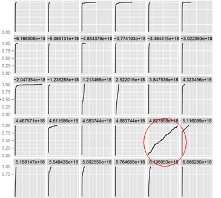
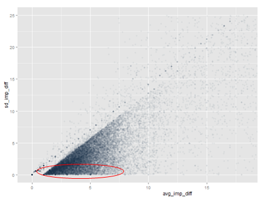
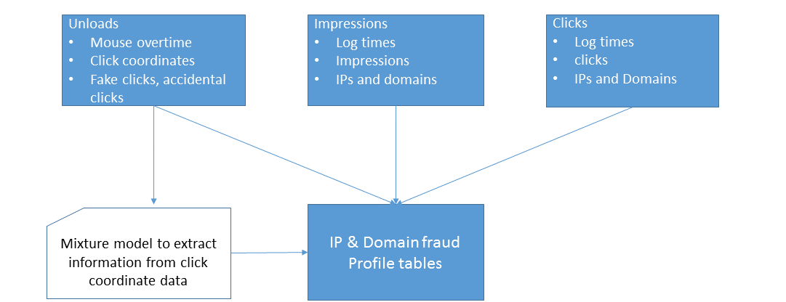

## About Lithuania

- Not so cold and windy as Denmark is right now
- Pretty good at basketball, FIBA ranking number #4
- Opposed to happiest people in the world - Danes, we Lithuanians are proud to have the highest number of suicides per capita in the World, averaging 31/100.000 per year
- Scoring #2 after Norway for hottest women https://docs.google.com/file/d/0BwGMR0W9Raj9dDk2SjN1eVpJN3c/edit
- Vilnius-R user group, established 2.5 years ago, couple of meet-ups were organized, data-dives/hackathons, also did some stuff together in Kaggle competitions
- by R-activity score we are #40, at least better Latvia, http://rapporter.net/custom/R-activity/#score/3, although this score is not up to date

## About me

- Regular Data Scientist @ Adform
- Wanted to play electric guitar in a band, but life forced me into Statistics and Programming
- Bachelors degree Financial and Actuarial Mathematics, Masters in Econometrics, Data Science on the side projects
- I also play tuba, banjo, drums and can do "Old MacDonald Had a Farm" and intro to "Don't Stop Believin'" on keyboard
- Experience with R ~ 5 years
- Alongside R I use Hive, Scalding and Python

## Exploratory Analysis on Fraud Detection project

- Third-party provider data with labels
- Looking at click bot source files @ github
- Checking geo-location data
- Proxies, ISPs
- TOR networks
- Pay-per-click labor exchanges on the web

<!---
## Some examples of exploratory analysis

ecdf of time before click for each cookie


   
## Some examples of exploratory analysis (2)

Time difference average and standard deviation between impressions


-->

## Click farmers


## Click mixture model

- Hypothesis: bot click coordinate distribution is uniform
- Mixture model: uniform component + other parametric distributions (truncated normal, beta, etc.)


## Data preprocessing

- Use only static content banners
- Normalize click coordinates by size
- Do some filtering on "spikes", on-frame and out-of-frame clicks

## Models - 1

Full Bayesian inference via `rstan`: beta components + uniform component

- pros
    - quite flexible model specification, can use different distributions
    - prior knowledge about parameters can be added
- cons
    - uses different syntax
    - implemented in `C` but still quite slow, unpredictable computing time when data has outliers and weird cases
    - having more than one component usually leads to degenerate solution, identifiable parametrization is not too elegant and is constrained by package data types

## Stan example: define model

```{r}
mix_model <- 
'
data {
  [input definitions - variable types, ranges]
}
parameters {
  [parameters to estimate]
}
model {
  [model likelihood functions, parameter priors]
}
generated quantities{
  [additional stuff you would like to monitor (out-of-sample errors, etc)]
}
'
```

## Stan example: fit using R interface
```{r, eval=FALSE}
fit1 <- stan(model_code=mix_model,
            iter = 2000, 
            chains = 4,
            data = list(x=x, y=y, ...))
            
getStanSummary <- function(fit){
  summary(fit)$summary
}

getStanSummary(fit1)['log_lik_test', 'mean']

```
## Models - 2

EM algorithm (modified script of `mixtools`): truncated normal components + uniform component

- pros
    - Faster than `rstan` and more stable
    - Is in a comfort zone of many people who had more or less advanced statistics training
- cons
    - Requires initialization points
    - Does not guarantee global optimum
    - Functions in packages have quite specific use cases, our case needed some modifications of source code

## Model selection

- We fit 1 Bayesian model, 5 EM algorithm based models (up to 5 normal components) with two different initializations each (11 models in total).
- Model selection is based on out of sample log-likelihood
- Trivia: why we filter out models with negative out of sample log-likelihood?

## Diagnostic plots


## Output

1. Score each click with probability of uniform distribution class
2. Add other metrics such as out/on-frame, corner, spike click counts
3. Aggregate these probabilities and metrics by ip, publisher domain, cookie and etc.
4. Combine this with metrics from other jobs to get final fraud score

## Production

- most of data preprocessing is done with `hive`
- daily/weekly jobs on AWS
  - 200GB transactions joined with 2TB RTB requests (to get attributes which are not present in transactions)
  - filter 30GB of unloads daily => deduplicate, filter and aggregate to weekly data
  - banner per week should have at least 1000 clicks this yields around 100 banners that get scored.
- model fitting, parallelized per banner done in `R`
- output is used by other jobs in the production which classify IPs and domains as fraudulent or legitimate

<!---

## Pipeline Architecture



-->

# Thank You!

