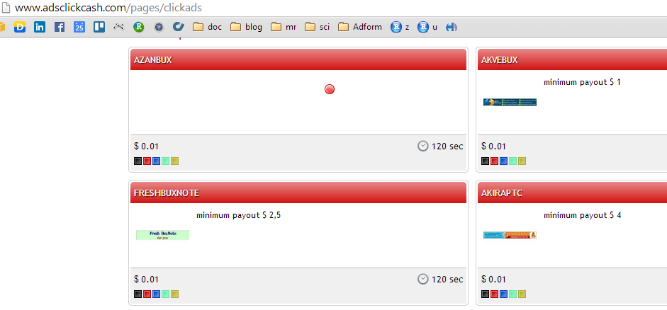
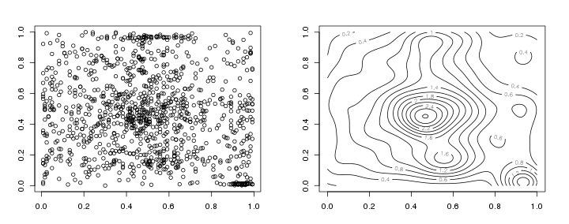
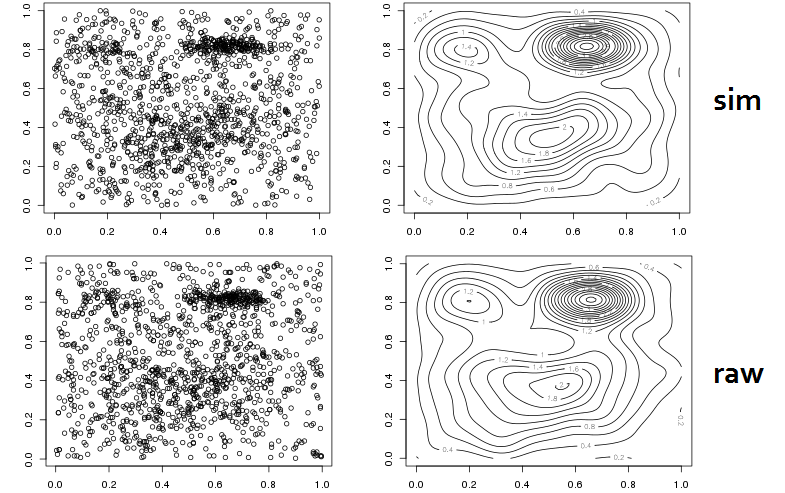

## R Markdown

This is an R Markdown presentation. Markdown is a simple formatting syntax for authoring HTML, PDF, and MS Word documents. For more details on using R Markdown see <http://rmarkdown.rstudio.com>.

When you click the **Knit** button a document will be generated that includes both content as well as the output of any embedded R code chunks within the document.


## Slide with R Code and Output

```{r}
summary(cars)
```

## Slide with Plot

```{r, echo=FALSE}
plot(cars)
```

## Click farmers



## Click mixture model

- Hypothesis: bot click coordinate distribution is uniform
- Mixture model: uniform component + other parametric distributions (truncated normal, beta, etc.)



## Data preprocessing

- Use only static content banners
- Normalize click coordinates by size
- Do some filtering on "spikes", on-frame and out-of-frame clicks

## Models - 1

Full Bayesian inference via `rstan`: beta components + uniform component

- pros
    - quite flexible model specification, can use different distributions
    - prior knowledge about parameters can be added
- cons
    - uses different syntax
    - implemented in `C` but still quite slow, unpredictable computing time when data has outliers and weird cases
    - having more than one component usually leads to degenerate solution, identifiable parametrization is not too elegant and is constrained by package data types

## Models - 2

EM algorithm (modified script of `mixtools`): truncated normal components + uniform component

- pros
    - Faster than `rstan` and more stable
    - Is in a comfort zone of many people who had more or less advanced statistics training
- cons
    - Requires initialization points
    - Does not guarantee global optimum
    - Functions in packages have quite specific use cases, our case needed some modifications of source code

## Model selection

- We fit 1 Bayesian model, 5 EM algorithm based models (up to 5 normal components) with two different inializations each (11 models in total).
- Model selection is based on out of sample log-likelihood
- Trivia: why we filter out models with negative out of sample log-likelihood?

## Diagnostic plots



## Output

1. Score each click with probability of uniform distribution class
2. Add other metrics such as out/on-frame, corner, spike click counts
3. Aggregate these probabilities and metrics by ip, publisher domain, cookie and etc.
4. Combine this with metrics from other jobs to get final fraud score